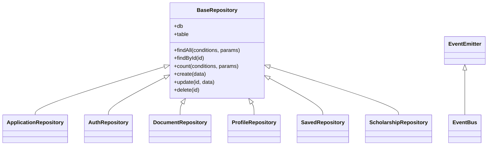

# 🔬 BÁO CÁO AUDIT OOP — ScholarsGo Backend
> **Ngày:** 08/05/2026 | **Phạm vi:** `backend/src/` (40+ files)

---

## BẢNG TỔNG HỢP ĐIỂM

| # | Tiêu chí | Điểm | Tối đa | Tình trạng |
|---|----------|------|--------|------------|
| 1 | Phân tách tầng | **15** | 20 | 🟡 1 module vi phạm nặng |
| 2 | Dependency Injection | **7** | 10 | 🟡 3 chỗ vi phạm |
| 3 | Tính Đóng gói | **7** | 10 | 🟡 Không nhất quán `_` vs `#` |
| 4 | Xử lý lỗi tập trung | **6** | 10 | 🟠 2 Controller bypass Global Handler |
| 5 | An toàn SQL Injection | **10** | 10 | ✅ Hoàn hảo |
| 6 | Đa hình & Kế thừa | **5** | 15 | 🟠 Chỉ có kế thừa, không có đa hình |
| 7 | Tell, Don't Ask | **3** | 15 | 🔴 Anemic Domain Model |
| 8 | SOLID Nâng cao | **3** | +10 | 🟠 Vi phạm Open/Closed |
| | **TỔNG** | **56** | **100** | |

---

## 1. PHÂN TÁCH TẦNG (15/20) 🟡

### ✅ Controller — ĐẠT (6 / 7 file)
Tất cả các Controller (Auth, Document, Profile, Scholarship, Application, Saved) chỉ làm đúng 1 việc: nhận `req` → gọi Service → trả `res`. Không chứa SQL, không chứa logic nghiệp vụ phức tạp.

### ✅ Service — ĐẠT (6 / 8 file)
`ApplicationService`, `AuthService`, `DocumentService`, `ProfileService`, `SavedService`, `ScholarshipService` đều không chứa `req`, `res`, hay SQL.

### ✅ Repository — ĐẠT (7 / 7 file)
Tất cả Repository chỉ chứa SQL, không có HTTP status code. Khi gặp lỗi DB constraint, repo ném mã lỗi domain (`APPLICATION_ALREADY_EXISTS`) thay vì throw 404/500 — đây là cách làm đúng.

### ❌ VI PHẠM: `recommend.service.js` — Service chứa Raw SQL

**File:** `src/services/recommend.service.js` — Dòng 1, 69-86

```javascript
// Dòng 1 — Service import trực tiếp module DB
const { query, queryOne } = require('../utils/db');

// Dòng 69-72 — Service viết Raw SQL
const profile = await queryOne(
  'SELECT * FROM profiles WHERE user_id = $1', [userId]
);

// Dòng 81-86 — Service viết Raw SQL
const scholarshipsResult = await query(
  `SELECT * FROM scholarships WHERE is_active = true AND deadline >= now()
   ORDER BY deadline ASC LIMIT 200`
);
```

> **Kết luận:** Module `recommend` là "hóa thạch" function-based từ Vùng 1, chưa migrate sang kiến trúc 4 lớp. **Trừ 5 điểm.**

### ⚠️ Nhẹ: `profile.repository.js` — Repo có side-effect vượt bảng

**File:** `src/repositories/profile.repository.js` — Dòng 90-94

```javascript
// Repo cập nhật bảng 'users' khi update profile — vượt phạm vi bảng 'profiles'
if (updates.full_name) {
  await this.db.query(
    'UPDATE users SET full_name = $1, updated_at = now() WHERE id = $2',
    [updates.full_name, userId]
  );
}
```

> Logic "khi update profile thì đồng bộ `full_name` sang bảng users" là **nghiệp vụ**, nên nằm ở Service chứ không phải Repository.

---

## 2. DEPENDENCY INJECTION (7/10) 🟡

### ✅ ĐẠT — 6 / 7 module
`container.js` tập trung wiring. Tất cả class nhận dependency qua constructor:
```
db → ScholarshipRepository → ScholarshipService → ScholarshipController
db → AuthRepository → AuthService → AuthController
... (tương tự cho Document, Profile, Application, Saved)
```

### ❌ Vi phạm 1: `recommend.controller.js` — Dòng 1
```javascript
// Import trực tiếp, bypass container.js
const recommendService = require('../services/recommend.service');
```

### ❌ Vi phạm 2: `recommend.service.js` — Dòng 1
```javascript
// Import trực tiếp DB, bypass DI
const { query, queryOne } = require('../utils/db');
```

### ❌ Vi phạm 3: `auth.service.js` — Dòng 10 vs Dòng 18
```javascript
// Dòng 10: Import trực tiếp eventBus (bypass DI)
const eventBus = require('../events/eventBus');

// Dòng 18: Constructor KHÔNG nhận eventBus dù container truyền vào
constructor(authRepository) {   // ← thiếu tham số eventBus
  this.repo = authRepository;
}

// Dòng 88: Dùng biến global thay vì this.eventBus
eventBus.emit('user.registered', {...});
```

> So sánh `DocumentService` làm đúng: `constructor(documentRepository, eventBus)` → dùng `this.eventBus.emit(...)`.

### ⚠️ Nhẹ: `document.service.js` — Dòng 17
```javascript
// Import trực tiếp storage functions thay vì inject qua constructor
const { uploadFile, deleteFile } = require('./storage.service');
```

---

## 3. TÍNH ĐÓNG GÓI (7/10) 🟡

### ✅ Dùng Private `#` đúng chuẩn:

| Class | Private methods |
|-------|----------------|
| `AuthService` | `#throwError`, `#hashPassword`, `#comparePassword`, `#generateToken`, `#buildUserPublic` |
| `DocumentService` | `#uploadToStorage`, `#parseStoragePath`, `#throwError`, `#ensureFound`, `#validateType`, `#ensureFile` |
| `ProfileService` | `#throwError`, `#validateUpdate` |
| `ScholarshipService` | `#ensureFound` |
| `ScholarshipRepository` | `#buildWhereClause`, `#attachSavedStatus`, `#checkSavedStatus` |
| `DocumentRepository` | `#extractStoragePath` |
| `ProfileRepository` | `#buildProfileUpdateSets` |

### ❌ Vi phạm: Dùng `_` thay vì `#` (không thực sự private)

| File | Method | Vấn đề |
|------|--------|--------|
| `application.controller.js:136` | `_handleError(res, err)` | Dùng `_` convention, JS vẫn truy cập được từ ngoài. Nên dùng `#handleError`. |
| `saved.controller.js:91` | `_handleError(res, err)` | Tương tự |
| `application.service.js:187` | `_formatApplication(row)` | Hàm format nội bộ, không cần public. Nên là `#formatApplication`. |

### ❌ Vi phạm: `recommend.service.js` — Không đóng gói gì
```javascript
// Hàm tính điểm là top-level function, không nằm trong class
const calculateMatchScore = (profile, scholarship) => { ... };
// Bất kỳ ai import file này đều truy cập được logic tính điểm
```

---

## 4. XỬ LÝ LỖI TẬP TRUNG (6/10) 🟠

### ✅ ĐẠT — 5 / 7 Controller dùng `next(error)`:
`AuthController`, `DocumentController`, `ProfileController`, `ScholarshipController`, `RecommendController` — tất cả dùng pattern:
```javascript
catch (error) { next(error); }
```

### ✅ Global Error Handler tồn tại: `errorHandler.js`
Bắt được: Supabase errors, JWT errors, Multer errors, operational errors (`isOperational`), và fallback 500.

### ❌ Vi phạm: `ApplicationController` — Bypass Global Error Handler

**File:** `src/controllers/application.controller.js` — Dòng 55-57, 136-151

```javascript
// Mỗi method đều gọi _handleError thay vì next(error)
catch (err) {
  return this._handleError(res, err);  // ❌ Không đi qua errorHandler.js
}

// _handleError tự map lỗi, tự trả response
_handleError(res, err) {
  const mapped = ERROR_MAP[err.message];
  if (mapped) {
    return res.status(mapped.status).json({...});
  }
  // Lỗi không dự kiến: chỉ console.error, không log stack trace đầy đủ
  console.error('[ApplicationController] Unhandled error:', err);
  return res.status(500).json({...});
}
```

### ❌ Vi phạm: `SavedController` — Cùng pattern

**File:** `src/controllers/saved.controller.js` — Dòng 42-44, 91-106
Giống hệt `ApplicationController` — tự map lỗi bằng `ERROR_MAP` riêng.

> **Hậu quả:** Nếu thêm logging middleware hoặc Sentry, 2 controller này sẽ bị "bỏ sót" vì lỗi không đi qua pipeline tập trung.

---

## 5. AN TOÀN SQL INJECTION (10/10) ✅

**Kết quả: KHÔNG TÌM THẤY LỖI SQL INJECTION.**

Toàn bộ query trong tất cả Repository và `recommend.service.js` đều dùng Parameterized Queries:
```javascript
// Ví dụ đúng — mọi file đều làm thế này:
'SELECT * FROM profiles WHERE user_id = $1', [userId]
'INSERT INTO users (email, password_hash, full_name, role) VALUES ($1, $2, $3, \'user\')', [email, passwordHash, fullName]
```

`BaseRepository` dùng `${this.table}` cho tên bảng — **không phải SQL Injection** vì giá trị được set cứng trong constructor (`super(db, 'users')`), không bao giờ nhận input từ user.

---

## 6. ĐA HÌNH & KẾ THỪA (5/15) 🟠

### ✅ Kế thừa đúng: `BaseRepository` → 6 Repository con



Quan hệ "is-a" hợp lý: `AuthRepository` **là một** `BaseRepository`. Các class con override method khi cần (ví dụ: `AuthRepository.findById` override để chỉ SELECT các cột public thay vì `*`). ✅

### ❌ Không có Đa hình (Polymorphism)
- **Không có Interface / Abstract Class** nào trong dự án.
- **Không có Strategy Pattern** — ví dụ: `StorageService` hardcode Supabase, không thể swap sang AWS S3 hay local storage mà không sửa code.
- **Không có Factory Pattern** — việc tạo error object lặp đi lặp lại ở mọi Service.

### 🔧 Cơ hội áp dụng đa hình chưa khai thác:

| Cơ hội | Hiện tại | Nên làm |
|--------|----------|---------|
| Storage Provider | `storage.service.js` hardcode Supabase | Tạo `IStorageProvider` interface, implement `SupabaseStorage`, `LocalStorage` |
| Error Handling | Mỗi Service tự tạo `new Error()` rồi gán `.statusCode`, `.isOperational` | Tạo `AppError extends Error`, `NotFoundError extends AppError`, `ValidationError extends AppError` |
| Scoring Algorithm | `calculateMatchScore()` hardcode logic | Strategy pattern: `IGPAScorer`, `IDegreeScorer`... để mở rộng tiêu chí mà không sửa code cũ |

---

## 7. "TELL, DON'T ASK" (3/15) 🔴

> [!CAUTION]
> **Đây là điểm yếu lớn nhất của dự án.** Toàn bộ hệ thống là Anemic Domain Model — không có Entity/Domain Object nào chứa logic. Mọi object chỉ là "túi data" trả về từ DB.

### ❌ Vi phạm 1: `ApplicationService` — "Ask" status rồi tự kiểm tra

**File:** `src/services/application.service.js` — Dòng 105-141

```javascript
// ❌ ASK: Service "hỏi" object lấy status ra, tự kiểm tra logic
const allowedNext = VALID_TRANSITIONS[existing.status] || [];
if (!allowedNext.includes(updates.status)) {
  throw err; // Service tự quyết định transition hợp lệ
}
if (existing.status === 'draft' && updates.status === 'submitted') {
  updates.applied_at = new Date().toISOString(); // Service tự gán field
}
```

```javascript
// ✅ TELL: Nên có Application entity tự quản lý state machine
class Application {
  transitionTo(newStatus) {
    if (!this.VALID_TRANSITIONS[this.status].includes(newStatus))
      throw new InvalidTransitionError(this.status, newStatus);
    if (this.status === 'draft' && newStatus === 'submitted')
      this.applied_at = new Date().toISOString();
    this.status = newStatus;
  }
  canDelete() {
    return !['submitted','under_review','interview','accepted'].includes(this.status);
  }
}
// Service chỉ cần: application.transitionTo('submitted');
```

### ❌ Vi phạm 2: `AuthService` — "Ask" password hash, tự so sánh

**File:** `src/services/auth.service.js` — Dòng 113-116

```javascript
// ❌ ASK: Lấy password_hash từ user object ra, tự compare
const valid = await this.#comparePassword(password, user.password_hash);
if (!valid) { this.#throwError('...', 401, 'INVALID_CREDENTIALS'); }
```

```javascript
// ✅ TELL: User entity tự verify password của chính nó
class User {
  async verifyPassword(plainPassword) {
    return bcrypt.compare(plainPassword, this.password_hash);
  }
}
// Service: if (!await user.verifyPassword(password)) throw ...
```

### ❌ Vi phạm 3: `RecommendService` — "Ask" toàn bộ fields rồi tính điểm ngoài

**File:** `src/services/recommend.service.js` — Dòng 4-66

```javascript
// ❌ ASK: Hàm bên ngoài lấy từng field của profile và scholarship ra, tự tính
if (profile.gpa && scholarship.min_gpa) {
  if (parseFloat(profile.gpa) >= parseFloat(scholarship.min_gpa)) {
    score += 30;
  }
}
```

```javascript
// ✅ TELL: Profile entity tự biết cách match với scholarship
class Profile {
  calculateMatchWith(scholarship) { /* tự tính dựa trên data của chính mình */ }
}
```

### ❌ Vi phạm 4: `ProfileService` — Validation bên ngoài object

**File:** `src/services/profile.service.js` — Dòng 38-63

```javascript
// ❌ ASK: Service lôi gpa ra, tự validate
if (updates.gpa !== undefined) {
  const gpa = parseFloat(updates.gpa);
  if (gpa < 0 || gpa > maxGpa) { this.#throwError(...); }
}
```

> **Tổng kết:** Dự án không có tầng Domain Model. Tất cả data từ DB trả về là plain object `{}`, không có method nào. **100% logic nằm trong Service** → Anemic Domain Model.

---

## 8. SOLID NÂNG CAO (3/+10) 🟠

### Open/Closed Principle — Vi phạm

| Khi thêm... | Phải sửa file... |
|-------------|-------------------|
| Loại document mới (ví dụ: `portfolio`) | `DocumentService.VALID_TYPES`, `upload.js ALLOWED_EXTS_BY_TYPE` |
| Bộ lọc scholarship mới | `ScholarshipRepository.#buildWhereClause` |
| Auth provider mới (Google OAuth) | `AuthService` toàn bộ |

### Liskov Substitution — ĐẠT ✅
Tất cả Repository con override method của `BaseRepository` mà không phá vỡ contract. Ví dụ: `AuthRepository.findById` vẫn trả `object | null` giống parent.

### Interface Segregation — Không áp dụng
Không có interface nào trong dự án, nên không đánh giá được.

---

## DANH SÁCH ƯU TIÊN SỬA CHỮA

| # | Mức độ | Vấn đề | File | Dòng |
|---|--------|--------|------|------|
| 1 | 🟠 HIGH | `recommend` module phá vỡ kiến trúc 4 lớp | `recommend.service.js` | 1, 69-86 |
| 2 | 🟠 HIGH | `Application` + `Saved` Controller bypass Global Error Handler | `application.controller.js`, `saved.controller.js` | 55-57, 136-151 |
| 3 | 🟡 MED | `AuthService` import `eventBus` trực tiếp, không nhận qua DI | `auth.service.js` | 10, 18 |
| 4 | 🟡 MED | Dùng `_` thay vì `#` cho private methods | `application.controller.js`, `saved.controller.js`, `application.service.js` | 136, 91, 187 |
| 5 | 🟡 MED | `DocumentService` import `storage.service` trực tiếp | `document.service.js` | 17 |
| 6 | 🟡 MED | `ProfileRepository` chứa side-effect cập nhật bảng `users` | `profile.repository.js` | 90-94 |
| 7 | 🟡 MED | Không có Error class hierarchy (`AppError`, `NotFoundError`...) | Toàn dự án | — |
| 8 | 🟢 LOW | Anemic Domain Model — thiếu Entity classes | Toàn dự án | — |
| 9 | 🟢 LOW | Thiếu đa hình: không có Interface, Strategy, Factory | Toàn dự án | — |
| 10 | 🟢 LOW | Vi phạm Open/Closed khi mở rộng tính năng | Nhiều file | — |

---

## KẾT LUẬN CHUNG

**Điểm mạnh:**
- SQL Injection: **10/10 hoàn hảo** — toàn bộ parameterized
- Kiến trúc 4 lớp áp dụng **nhất quán ở 6/7 module** (trừ recommend)
- DI container tập trung, wiring rõ ràng
- Encapsulation dùng `#` private fields ở hầu hết Service/Repository

**Điểm yếu chính:**
- **Anemic Domain Model** (3/15) — đây là "gót chân Achilles" lớn nhất. Không có Entity class nào. Service đang "Ask" data rồi tự xử lý thay vì "Tell" object tự lo logic của mình.
- **Thiếu Đa hình** (5/15) — chỉ có kế thừa cơ bản, không có Interface/Strategy/Factory.
- **Không nhất quán** error handling giữa các module.
